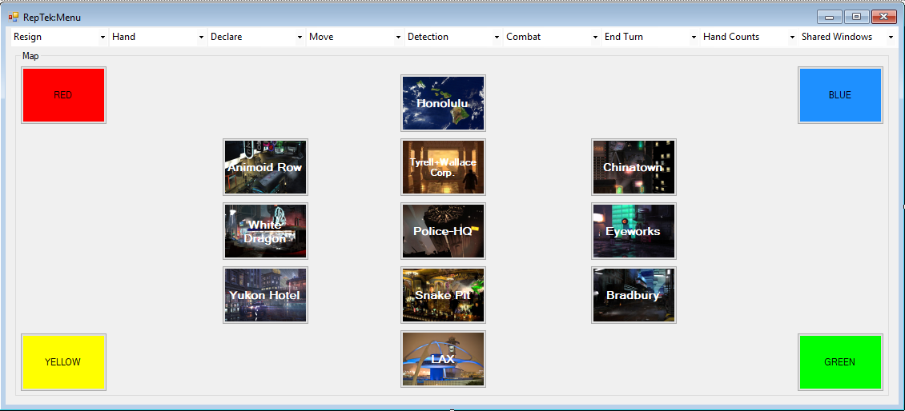
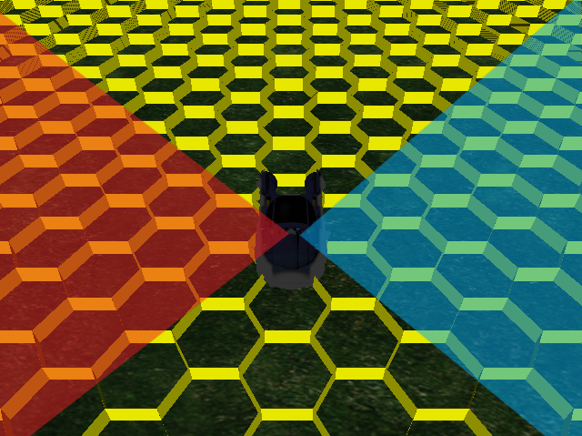

BLADE RUNNER: 'REP' 'TEC' -- a multi-strategy, multi-level role playing game 

 (\C\) 2018
Notice/Disclaimer:
No copyright nor trademark infringement is intended(*). 
The individual copyright holders retain their respective copyrights/trademark, with 
derived images used with permissions pending, in an effort to promote research into the subject
of what an "open source" game and animation engine *might* look like. Fair use is intended, for the purpose of creating a "parody" of subject matter.
This is partly driven by Google(TM) keword+image searches, 
where "found" art images that may be subject to copyright, whereas the result of the Google(TM) search result is being shared with the idea that the "parody" material is "copyleft", modifiable, and share-able; 
such as e.g., 
searching for "futuristic interiors, futuristic exteriors, BR game, C# BR game", etc.
The collection/gameplay is mostly inspired by "Blade Runner: Rep-Detect" (2012) by Designer I. J. Thompson,
an "unlicensed/unauthorized" creation with a corresponding module that can be played in the VASSAL game engine.
Besides aiming to create a more "native" and potentially cross-platform-esque game/animations,
there is a long-term, over-arching goal of fostering reseach into gaming and
filling in an expanded story/universe, which is anticipated to draw support from the artistic and community.
This seems to suggest, also, that the choice of license may need to be left deferred, also, pending the results of the search.
With regard to the referenced software libraries, a license compatibility model appears to be implied with the use of CC (creative commons), CPOL (Code Project Open License), Gnu GPLv3, LGPL, MIT, etc.:
------------------------------------------------------------------------------------
License type  | Description 					| Acronym | Remix | Cultural | Open
------------------------------------------------------------------------------------
Public Domain | Freeing content globally without (r)estrictions
										 		CC0 	Yes 	Yes Yes 	Yes
CC-BY 		| Attribution alone 				BY 		Yes 	Yes Yes 	Yes
CC-BY-SA 	| Attribution + ShareAlike 			BY-SA 	Yes Yes Yes Yes
CPOL		| Open content attribution/commerci CPOL	Yes	Yes	Yes	Yes
MIT			| "									MIT	Yes	Yes	Yes	Yes	

Original Music by Vangelis(*)
Arranged by rtrose247

* all content subject to change

